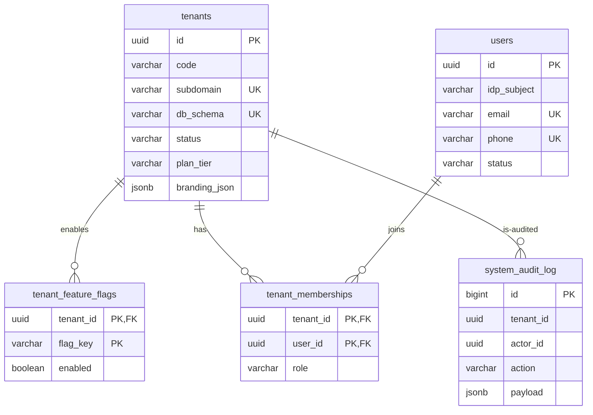
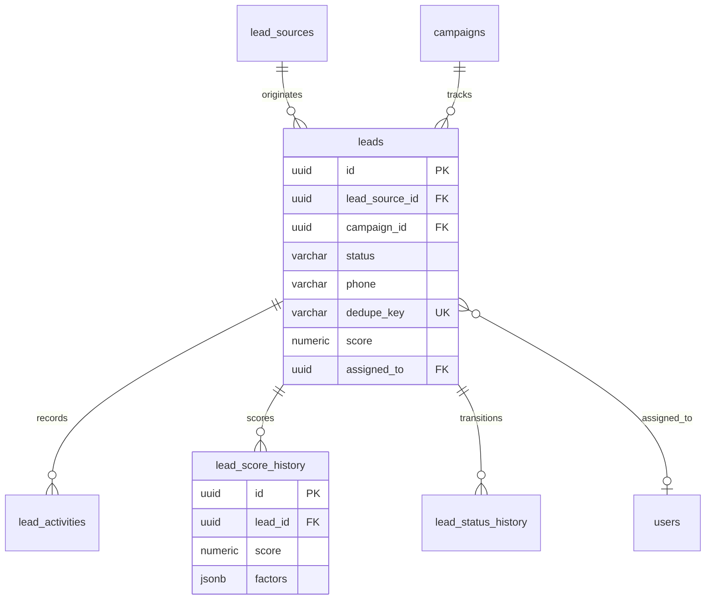
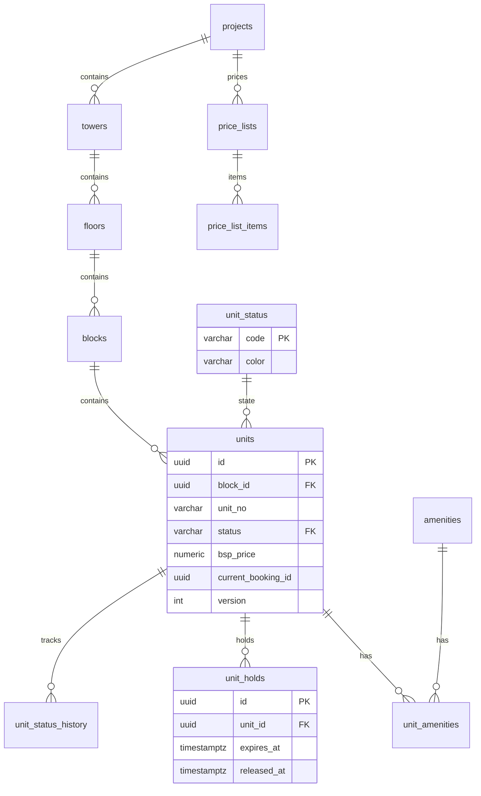
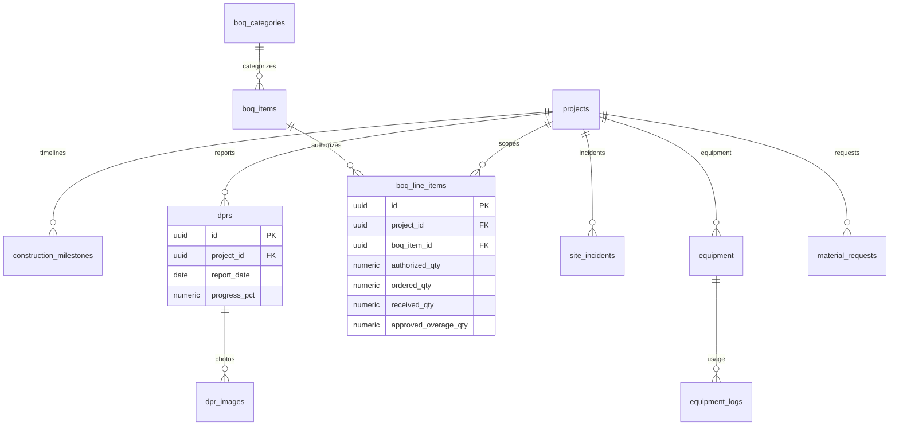
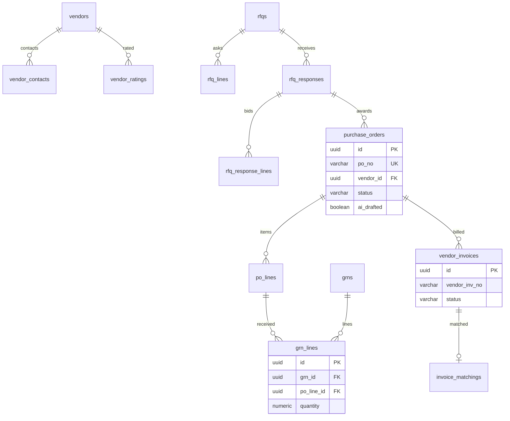
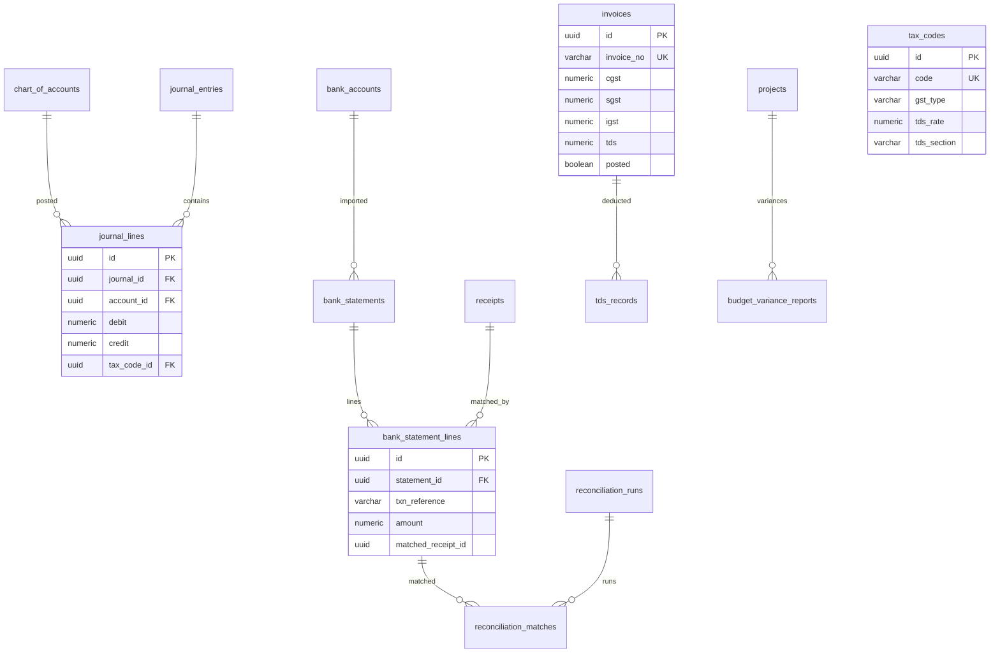
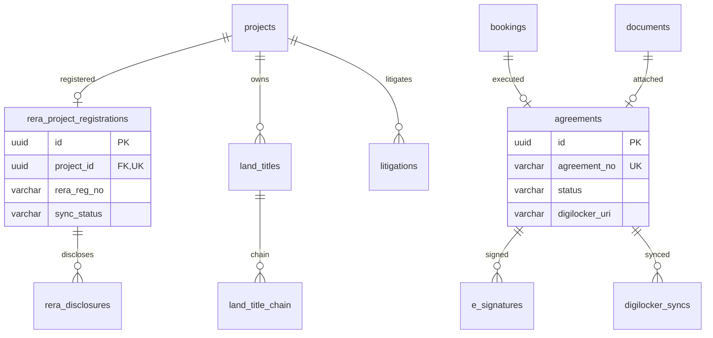
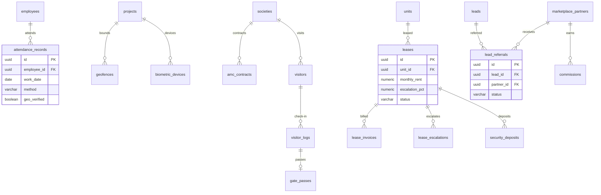
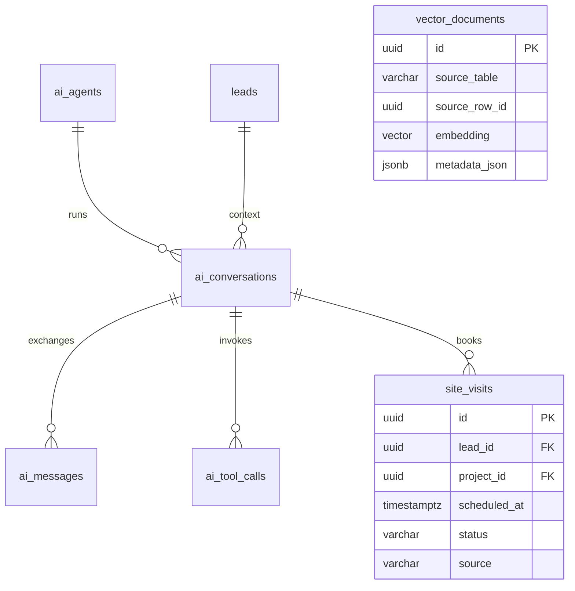

# EstateFlow — Database Schema Design

**Engine:** PostgreSQL 16+
**Isolation model:** Hybrid "Bridge" multi-tenancy — per-tenant schemas + shared `public` control plane
**ORM:** EF Core (backed by migrations from `sql/02_tenant_schema.sql`)
**Vector:** pgvector (per-tenant partitioned)
**Caching/locks:** Redis (sessions, cache, unit hold locks) — ephemeral only

---

## 1. Design Principles

| Principle | Description |
|---|---|
| Schema-per-tenant | Each tenant's data lives in a dedicated PostgreSQL schema. No `tenant_id` filters required; isolation is enforced by the schema boundary. |
| No cross-tenant FKs | Foreign keys never cross tenant schemas; cross-tenant references go through the `public` control plane only. |
| Money as numeric | All monetary values use `numeric(19,2)`; tax fields (CGST/SGST/IGST/TDS) are first-class columns. |
| UTC everywhere | `timestamptz` storage; tenant timezone (`Asia/Kolkata`) applied at presentation. |
| Audit + immutability | `audit_logs` capture row changes; financial/legal records are posted (append-only) and never mutated. |
| Versioned entities | `version`/`updated_at` used with optimistic concurrency (critical for unit status). |
| Soft identity | Tenant `users` reference the platform `public.users` global identity; RBAC is resolved inside the tenant schema. |

---

## 2. Control Plane (`public`) — `sql/01_public_schema.sql`



**Tenant provisioning flow**
1. Insert row in `tenants` (generates unique `subdomain`, `db_schema`).
2. `create_tenant_schema(tenant_id)` creates the physical schema.
3. Provisioning job applies `02_tenant_schema.sql` with `search_path` set to that schema.
4. Bootstrap default roles, permissions, unit statuses, tax codes, AI agents.

---

## 3. Tenant Schema — Module ERDs

### 3.1 CRM & Omnichannel Leads



**Concurrency/dedupe:** `dedupe_key` (phone/email/WhatsApp ID) is unique-partial; duplicates rejected before insert (TR-CRM-006).

### 3.2 Property & Inventory



**Unit states:** `available`(green) / `blocked`(yellow) / `token_paid`(blue) / `sold`(red) / `under_maintenance`.
**Locking (TR-INV-004):** Redis holds the lock for 15 min at quote time; `unit_holds` persists an auditable trace. `units.version` + optimistic update is the DB backstop.

### 3.3 Sales, Quotations & Collections

```mermaid
erDiagram
    customers ||--o{ quotations : "requests"
    quotations ||--o{ quotation_approvals : "approves"
    customers ||--o{ bookings : "books"
    quotations ||--o| bookings : "converts"
    units ||--o| bookings : "1:1"
    bookings ||--o{ payment_schedules : "schedules"
    payment_schedules ||--o{ payment_schedule_lines : "lines"
    bookings ||--o{ invoices : "invoices"
    payment_schedule_lines ||--o{ invoices : "bills"
    invoices ||--o{ receipts : "collects"
    invoices ||--o{ invoice_lines : "details"

    quotations {
        uuid id PK
        varchar quote_no UK
        uuid unit_id FK
        uuid customer_id FK
        numeric discount_pct
        varchar status
    }
    quotation_approvals {
        uuid id PK
        uuid quotation_id FK
        varchar status
    }
    bookings {
        uuid id PK
        varchar booking_no UK
        uuid unit_id FK UK
        varchar status
    }
    payment_schedule_lines {
        uuid id PK
        uuid schedule_id FK
        date due_date
        numeric total_due
    }
```

**Discount rule (TR-SAL-002):** `discount_pct > 5` forces `quotations.status = pending_approval` and creates a `quotation_approvals` row routed to the VP of Sales via Temporal.

### 3.4 Construction ERP & Site Operations



**BOQ enforcement (TR-CON-001, TR-PRO-003):** `ordered_qty + approved_overage_qty` cannot exceed `authorized_qty`; exceeding triggers an approval workflow.

### 3.5 Procurement & Vendor Management



### 3.6 Finance & Indian Compliance



**Compliance (TR-FIN-002/003):** `tax_codes` drive CGST/SGST vs IGST by GSTIN/state; TDS 194-IA auto-applied when property value > ₹50 Lakh. `invoices.posted = true` makes the record immutable. Bank matching (MT940/CAMT) writes `reconciliation_matches` with confidence scores.

### 3.7 Legal & RERA Compliance



### 3.8 HR, Facility, Rental, Marketplace (condensed)



### 3.9 AI Layer & Site Visits



---

## 4. Cross-Cutting Conventions

| Convention | Rule |
|---|---|
| Primary keys | `uuid` default `gen_random_uuid()` |
| Money | `numeric(19,2)` |
| Percentages | `numeric(5,2)` (discounts, GST, TDS) / `numeric(8,2)` (variance) |
| Booleans for business state | status columns with `CHECK` constraints instead of raw booleans |
| Enum policy | Native `CHECK` constraints (not PG enums) to allow additive migration without `ALTER TYPE` |
| Timestamps | `timestamptz`, UTC; `updated_at` maintained by app layer |
| Audit | `audit_logs` rows for INSERT/UPDATE/DELETE; immutable records use `posted` flags |
| Attachments | All files → S3-compatible storage via `file_assets`; DB stores references only |
| AI embeddings | `vector_documents.embedding` (pgvector, dim 1536 for OpenAI) tagged with tenant via schema isolation |

## 5. Files

| File | Contents |
|---|---|
| `sql/01_public_schema.sql` | Control plane: tenants, users, memberships, system audit, provisioning helper |
| `sql/02_tenant_schema.sql` | Tenant schema template: 117 tables across 16 modules |
